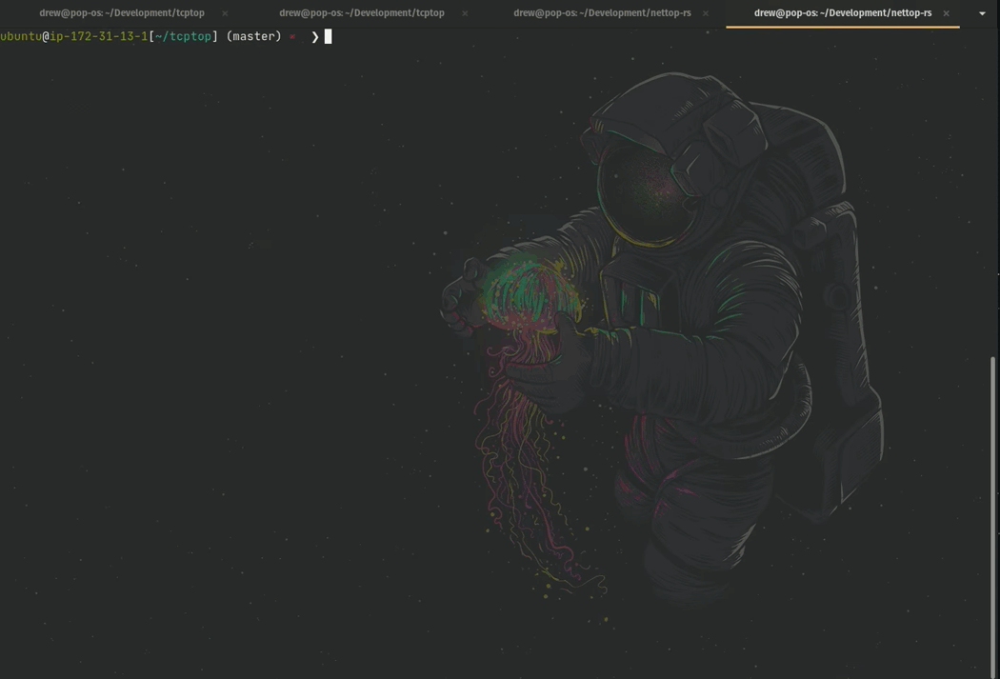

# TCPtop

A CLI tool for inspecting TCP sockets like top.

This works by polling the netlink sock_diag subsystem on an interval to scrape all TCP socket information. Information about each socket is kept on a 30 second circular buffer.

TODO:
-----

- [ ] implement sorting/searching
- [ ] command-line flags with adjustable config options
